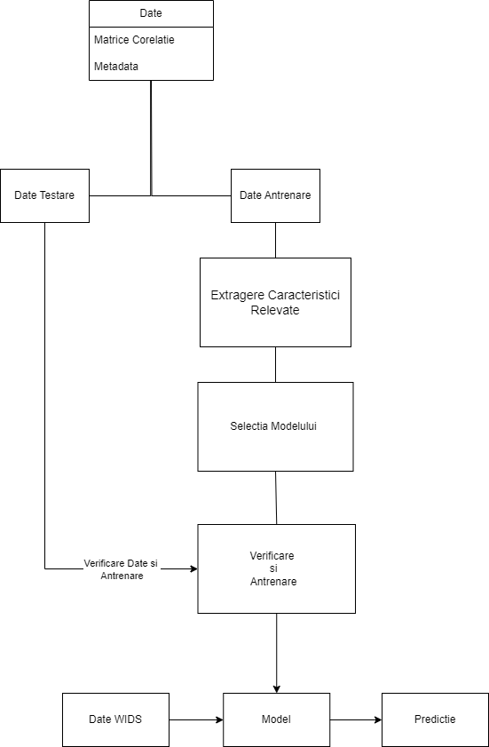

# WiDS Datathon++ 2025 University Challenge
## Descriere
Provocarea universitară WiDS Datathon++ a fost dezvoltată împreună cu Inițiativa pentru Sănătatea Creierului la Femei Ann S. Bowers (WBHI) în colaborare cu Universitatea Cornell și UC Santa Barbara. Seturile de date și suportul sunt oferite de Healthy Brain Network (HBN), inițiativa științifică semnătură a Child Mind Institute, și de proiectul Reproducible Brain Charts (RBC).

Tulburările neuropsihiatrice care apar în perioada de dezvoltare, precum anxietatea, depresia, autismul și ADHD, afectează deseori băieții și fetele în moduri diferite și în grade diferite. Această provocare datathon își propune să ajute cercetătorii să dezvolte și să împărtășească modele care prezic vârsta copiilor și adolescenților, de sex masculin și feminin, pe baza tiparelor de activitate cerebrală individuală. Prin înțelegerea modului în care dezvoltarea creierului se desfășoară diferit la băieți și fete, cercetătorii speră să îmbunătățească înțelegerea tulburărilor neuropsihiatrice care se dezvoltă în copilărie și adolescență. O mai bună înțelegere a acestor tulburări poate contribui la depistarea timpurie, în special pentru fetele cu risc, și la crearea unor tratamente specifice. Scopul este de a îmbunătăți intervențiile clinice și de a oferi îngrijire mai bună pentru tulburările psihiatrice care apar adesea în copilărie sau adolescență.

## Arhitectura

### Descriere arhitectură
Datele se împart în 2 categorii: matricea de corelație extrasă din imagini MRI și metadatele despre persoane. Metadatele oferă informații despre starea psihologică a persoanei, dar și despre anumite trăsături. Acestea se împart în două categorii: datele pentru testare și datele pentru antrenarea modelului. Urmează selectarea caracteristicilor esențiale, care au o pondere semnificativă asupra determinării vârstei persoanei. Se va alege un model de regresie care să fie antrenat cu ajutorul datelor de antrenare. Acești pași se vor repeta până la găsirea unui model cu o peformanță bună. Astfel, după andtrenarea modelului, vor fi introdse datele de testare de la WIDS și vor fi înărcate pe platformă pentru verificare.

## Literatura de specialitate

| Nr. | Autor(i) / An | Titlul articolului / proiectului | Aplicație / Domeniu | Tehnologii utilizate | Metodologie / Abordare | Rezultate | Limitări | Comentarii suplimentare |
|:---:|:-------------:|:--------------------------------:|:-------------------:|:--------------------:|:----------------------:|:---------:|:--------:|:-----------------------:|
| 1 | Martina&nbsp;J.&nbsp;Lund   Dag&nbsp;Alnæs   Ann-Marie&nbsp;G.&nbsp;de&nbsp;Lange   &nbsp;A.&nbsp;Andreassen   Lars&nbsp;T.&nbsp;Westlye   Tobias&nbsp;Kaufmann | Brain age prediction using fMRI network coupling in youths and associations with psychiatric symptoms | Predictia varstei / Medical | FSL, R, MATLAB | Metode de avansare preprocesare, Shrinkage Estimation of Regression Coefficients, modele de regresie liniara | Performanta r=0.54 | Pacienti cu caracteristici lipsa |    |
| 2 | Siamak K. Sorooshyari | Beyond network connectivity: A classification approach to brain age prediction with resting-state fMRI | Predictia varstei/ medical | Machine Learning,MATLAB,R | SVM (Support Vector Machine) cu kernel liniar; Pentru validarea rezultatelor, s-au folosit tehnici de leave-one-out cross-validation și Monte Carlo sampling cu 1000 de iterații pentru 42 de regiuni extrase de interes. | AR=0.633 | Lipsa Tehnicilor de Armonizare, Spațiul Caracteristicilor Nu a fost Optimizat | |
| 3 | Sepideh Baghernezhad; Mohammad Reza Daliri | Age-related changes in human brain functional connectivity using graph theory and machine learning techniques in resting-state fMRI data | Predictia varstei/ medical | Teoria grafurilor,Preprocesarea fMRI, Machine Learning | Păstrarea celor mai puternice conexiuni pentru a elimina zgomotul, creând rețele sparte pentru comparații între grupuri. Selectarea trăsăturilor folosind Fisher score și testul Kruskal-Wallis, urmat de clasificare prin SVM, DT și KNN, cu validare K-fold. | acuratețea de 82,2% | Utilizarea unui singur set de date, Posibile erori de clasificare, Dimensiunea redusă a eșantionului | |
| 4 | Shammi More, Georgios Antonopoulos, Felix Hoffstaedter, Julian Caspers, Simon B. Eickhoff, Kaustubh R. Patil | Brain-age prediction: A systematic comparison of machine learning workflows | medicina/predictia varstei | tehnologii de achiziție a datelor neuroimagistice, Algoritmi de machine learning, PCA | Pentru comparația cu modelul brainageR, s-a folosit un alt set de preprocesare bazat pe SPM12, care oferă segmentări similare. În vederea reducerii dimensionalității și pentru a obține reprezentări relevante din datele de neuroimagistică, s-au folosit două strategii principale: Voxel-wise GMV si Parcel-based GMV. Evaluarea Performanței | acuratețe ridicată, cu o eroare medie absolută (MAE) între 3,9 și 4,8 ani | Limitările algoritmilor, Evaluarea limitată a tehnologiilor de deep learning, Dimensionalitatea ridicată a datelor neuroimagistice | |
| 5 | Xin Now Fengging Zhang John Kaunas Hualou Liang | Improved prediction of brai'n age using multimodal neuroimaging data | Medicina/Predicția Varstei | Statistical analysis Machine learning methods The rationale of brain age prediction | Statistical analysis, Machine learning methods, The rationale of brain age prediction | R2 = .774, MAE = 1.384 | Corelația slabă între vârsta cronologică și vârsta creierului, Calitatea diferita a imaginilor | |
