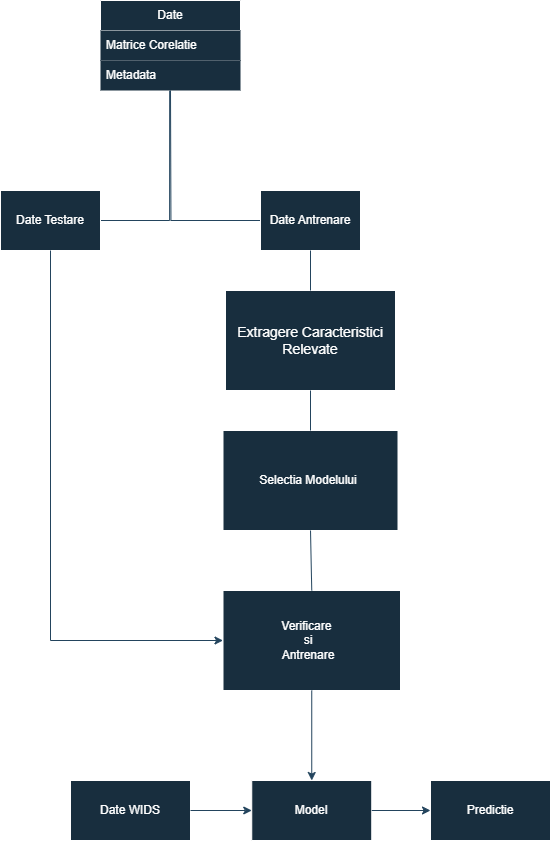

# WiDS Datathon++ 2025 University Challenge
## Literatura de specialitate

| Nr. | Autor(i) / An | Titlul articolului / proiectului | Aplicație / Domeniu | Tehnologii utilizate | Metodologie / Abordare | Rezultate | Limitări | Comentarii suplimentare |
|:---:|:-------------:|:--------------------------------:|:-------------------:|:--------------------:|:----------------------:|:---------:|:--------:|:-----------------------:|
| 1 | Martina&nbsp;J.&nbsp;Lund   Dag&nbsp;Alnæs   Ann-Marie&nbsp;G.&nbsp;de&nbsp;Lange   &nbsp;A.&nbsp;Andreassen   Lars&nbsp;T.&nbsp;Westlye   Tobias&nbsp;Kaufmann | Brain age prediction using fMRI network coupling in youths and associations with psychiatric symptoms | Predictia varstei / Medical | FSL, R, MATLAB | Metode de avansare preprocesare, Shrinkage Estimation of Regression Coefficients, modele de regresie liniara | Performanta r=0.54 | Pacienti cu caracteristici lipsa |    |
| 2 | Siamak K. Sorooshyari | Beyond network connectivity: A classification approach to brain age prediction with resting-state fMRI | Predictia varstei/ medical | Machine Learning,MATLAB,R | SVM (Support Vector Machine) cu kernel liniar; Pentru validarea rezultatelor, s-au folosit tehnici de leave-one-out cross-validation și Monte Carlo sampling cu 1000 de iterații pentru 42 de regiuni extrase de interes. | AR=0.633 | Lipsa Tehnicilor de Armonizare, Spațiul Caracteristicilor Nu a fost Optimizat | |
| 3 | Sepideh Baghernezhad; Mohammad Reza Daliri | Age-related changes in human brain functional connectivity using graph theory and machine learning techniques in resting-state fMRI data | Predictia varstei/ medical | Teoria grafurilor,Preprocesarea fMRI, Machine Learning | Păstrarea celor mai puternice conexiuni pentru a elimina zgomotul, creând rețele sparte pentru comparații între grupuri. Selectarea trăsăturilor folosind Fisher score și testul Kruskal-Wallis, urmat de clasificare prin SVM, DT și KNN, cu validare K-fold. | acuratețea de 82,2% | Utilizarea unui singur set de date, Posibile erori de clasificare, Dimensiunea redusă a eșantionului | |
| 4 | Shammi More, Georgios Antonopoulos, Felix Hoffstaedter, Julian Caspers, Simon B. Eickhoff, Kaustubh R. Patil | Brain-age prediction: A systematic comparison of machine learning workflows | medicina/predictia varstei | tehnologii de achiziție a datelor neuroimagistice, Algoritmi de machine learning, PCA | Pentru comparația cu modelul brainageR, s-a folosit un alt set de preprocesare bazat pe SPM12, care oferă segmentări similare. În vederea reducerii dimensionalității și pentru a obține reprezentări relevante din datele de neuroimagistică, s-au folosit două strategii principale: Voxel-wise GMV si Parcel-based GMV. Evaluarea Performanței | acuratețe ridicată, cu o eroare medie absolută (MAE) între 3,9 și 4,8 ani | Limitările algoritmilor, Evaluarea limitată a tehnologiilor de deep learning, Dimensionalitatea ridicată a datelor neuroimagistice | |
| 5 | Xin Now Fengging Zhang John Kaunas Hualou Liang | Improved prediction of brai'n age using multimodal neuroimaging data | Medicina/Predicția Varstei | Statistical analysis Machine learning methods The rationale of brain age prediction | R2 = .774, MAE = 1.384 | Corelația slabă între vârsta cronologică și vârsta creierului, Calitatea diferita a imaginilor | |

## Arhitectura

## Descriere
